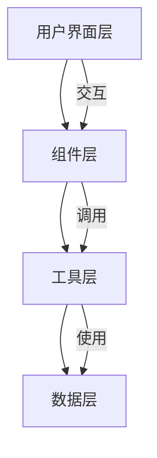

## 1. Architecture Design
纯前端 React 应用，使用 Vite 构建，TailwindCSS 样式，Chart.js 绘制图表。



## 2. Technology Description
- **Frontend**: React@18 + TypeScript + TailwindCSS@3 + Vite
- **Initialization Tool**: vite-init
- **图表库**: Chart.js + react-chartjs-2
- **图标库**: lucide-react
- **状态管理**: React Hooks (useState)
- **无需后端**: 纯前端实现

## 3. Route Definitions
| Route | Purpose |
|-------|---------|
| / | 首页/测算页，唯一页面 |

## 4. API Definitions (if backend exists)
无需后端 API

## 5. Server Architecture Diagram (if backend exists)
无需后端

## 6. Data Model
### 6.1 地区社保参数数据
```typescript
interface ProvinceData {
  name: string;
  cities: string[];
  avgSalary: number; // 社会平均工资
  personalRate: number; // 个人缴费比例
  companyRate: number; // 单位缴费比例
  accountRate: number; // 个人账户比例
}

interface CityData {
  name: string;
  province: string;
  avgSalary: number;
  personalRate: number;
  companyRate: number;
  accountRate: number;
}
```

### 6.2 测算结果数据
```typescript
interface CalculationResult {
  basicPension: number;
  personalAccountPension: number;
  totalPension: number;
  replacementRate: number;
}
```

### 6.3 表单输入数据
```typescript
interface FormData {
  province: string;
  city: string;
  age: number;
  gender: 'male' | 'female';
  monthlySalary: number;
  yearsOfPayment: number;
  personalAccountBalance: number;
}
```
